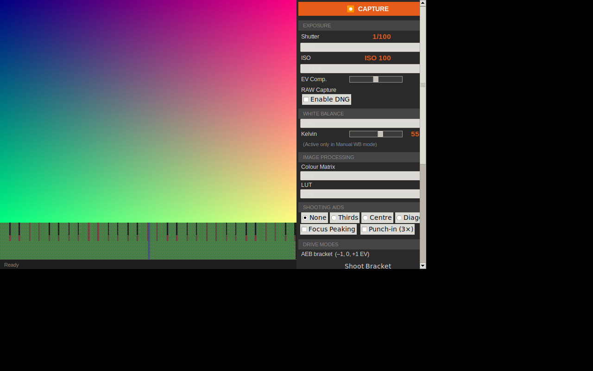

# Raspberry-Pi-Cam

A full-featured, open-source camera control application for the Raspberry Pi.
Built with Python + tkinter, it targets picamera2 on Pi hardware and includes
a software stub so you can develop and test on any machine.



---

## Features

### Core Exposure Control
| Feature | Module |
|---|---|
| Manual Shutter Speed (1/8000 s – 30 s) | `camera/exposure.py` |
| Manual ISO (100 – 3200) | `camera/exposure.py` |
| Exposure Compensation ±3 EV in ⅓ stops | `camera/exposure.py` |

### Image Processing & Aesthetics
| Feature | Module |
|---|---|
| RAW (DNG) Image Capture | `camera/capture.py` |
| Custom Colour Matrices (None / Vivid / Cool / Warm) | `camera/image_processing.py` |
| Per-channel LUTs (Identity / S-Curve / custom .npy) | `camera/image_processing.py` |
| Manual White Balance (presets + Kelvin slider) | `camera/white_balance.py` |

### Interface & Shooting Aids
| Feature | Module |
|---|---|
| Live RGB Histogram | `ui/histogram.py` |
| Focus Peaking (Laplacian edge highlight) | `ui/overlays.py` |
| Digital Punch-in 3× magnified preview | `ui/overlays.py` |
| Composition Overlays (Rule of Thirds / Centre Cross / Diagonal) | `ui/overlays.py` |

### Advanced Drive Modes
| Feature | Module |
|---|---|
| Auto Exposure Bracketing (AEB) | `camera/drive_modes.py` |
| Intervalometer / Time-lapse | `camera/drive_modes.py` |

### Motorized Autofocus Control
| Feature | Module |
|---|---|
| Motor Driver Interface (GPIO / I²C / SPI / Stub) | `autofocus/motor.py` |
| Contrast-Detection AF Algorithm (CDAF) | `autofocus/cdaf.py` |
| Lens Calibration & Homing Sequence | `autofocus/calibration.py` |
| Single AF Mode (AF-S) | `autofocus/af_modes.py` |
| Continuous AF Mode (AF-C) | `autofocus/af_modes.py` |
| Focus Area Selection (Wide / Zone / Single-point) | `autofocus/af_modes.py` |
| Manual Focus Override (step buttons / keyboard) | `autofocus/af_modes.py` |

---

## Installation

```bash
# Clone the repo
git clone https://github.com/Themidrangeplayer/Raspberry-Pi-Cam.git
cd Raspberry-Pi-Cam

# Install Python dependencies
pip install -r requirements.txt
```

> **Note:** `picamera2` and `RPi.GPIO` / `smbus2` / `spidev` are only required
> on a Raspberry Pi.  On other machines the application runs in stub mode
> (software-only camera and motor).

---

## Usage

```bash
# Development / stub mode (no hardware needed)
python main.py

# With GPIO motor driver
python main.py --driver gpio

# With I²C motor driver (e.g. DRV8830)
python main.py --driver i2c

# With SPI motor driver (e.g. L6470)
python main.py --driver spi

# Custom output directory and verbose logging
python main.py --output ~/Photos --loglevel DEBUG
```

### Keyboard Shortcuts

| Key | Action |
|-----|--------|
| `Space` | Capture image |
| `F` | Trigger AF (AF-S mode) |
| `←` / `→` | Manual focus ±1 step |
| `Shift+←` / `Shift+→` | Manual focus ±10 steps |

### Setting the Focus Point

Click anywhere on the live preview to move the AF / focus-peaking ROI to
that position (used in Single-point and Zone focus area modes).

---

## Project Structure

```
Raspberry-Pi-Cam/
├── main.py                    Entry point (argparse CLI)
├── requirements.txt
├── camera/
│   ├── capture.py             CameraManager – picamera2 wrapper + stub
│   ├── exposure.py            Shutter / ISO / EV helpers & tables
│   ├── white_balance.py       AWB presets + Kelvin→gain conversion
│   ├── image_processing.py    Colour matrices, LUT apply/load
│   └── drive_modes.py         AEBController, Intervalometer
├── autofocus/
│   ├── motor.py               Driver factory (GPIO / I²C / SPI / stub)
│   ├── cdaf.py                Contrast-Detection AF algorithm
│   ├── calibration.py         Homing sequence + focus distance map
│   └── af_modes.py            AF-S, AF-C, area selection, manual override
├── ui/
│   ├── app.py                 Main tkinter application window
│   ├── histogram.py           Histogram compute + canvas render
│   ├── overlays.py            Composition overlays, focus peaking, punch-in
│   └── widgets.py             Style constants + reusable widget classes
└── tests/
    ├── test_exposure.py
    ├── test_white_balance.py
    ├── test_image_processing.py
    ├── test_drive_modes.py
    ├── test_motor.py
    ├── test_cdaf.py
    ├── test_overlays.py
    └── test_histogram.py
```

---

## Running Tests

```bash
pip install pytest numpy Pillow
python -m pytest tests/ -v
```

---

## Hardware Wiring (GPIO motor driver)

| Signal | Default BCM pin |
|--------|----------------|
| STEP   | 23 |
| DIR    | 24 |
| Limit switch (near end) | configurable via `HomingController(limit_pin=…)` |

To change pins, edit `HomingController` and `create_driver("gpio", step_pin=X, dir_pin=Y)` in `main.py`.

---

## License

MIT
